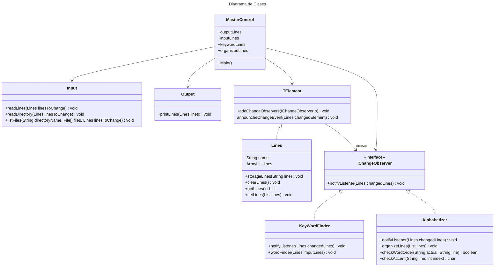

# DirectoryExplorer

```mermaid
---
title: Diagrama de Clases
---
classDiagram
    MasterControl --> Input
    MasterControl --> Output
    MasterControl --> TElement
    TElement <|.. Lines
    TElement -->"observes" IChangeObserver
    IChangeObserver <|.. KeyWordFinder
    IChangeObserver <|.. Alphabetizer
    MasterControl --> IChangeObserver
    

    class MasterControl{
      +outputLines
      +inputLines
      +keywordLines
      +organizedLines
      +Main()
    }

    class TElement{
      +addChangeObservers(IChangeObserver o)void
      announcheChangeEvent(Lines changedElement)void
    }

    class IChangeObserver{
        <<interface>>
      +notifyListener(Lines changedLines) void
    }

    class KeyWordFinder{
        +notifyListener(Lines changedLines) void
        +wordFinder(Lines imputLines)void
    }   

    class Alphabetizer{
        +notifyListener(Lines changedLines) void
        +organizeLines(List<String> lines) void
        +checkWordOrder(String actual, String line)boolean
        +checkAccent(String line, int index)char
    }

    class Lines{
        -String name
        -ArrayList<String> lines
        +storageLines(String line) void
        +clearLines()void
        +getLines()List<String>
        +setLines(List<String> lines)void
    }

    class Input{
        +readLines (Lines linesToChange) void
        +readDirectory(Lines linesToChange) void
        +listFiles(String directoryName, File[] files, Lines linesToChange)void
    }

    class Output{
        +printLines(Lines lines) void
    }
```
